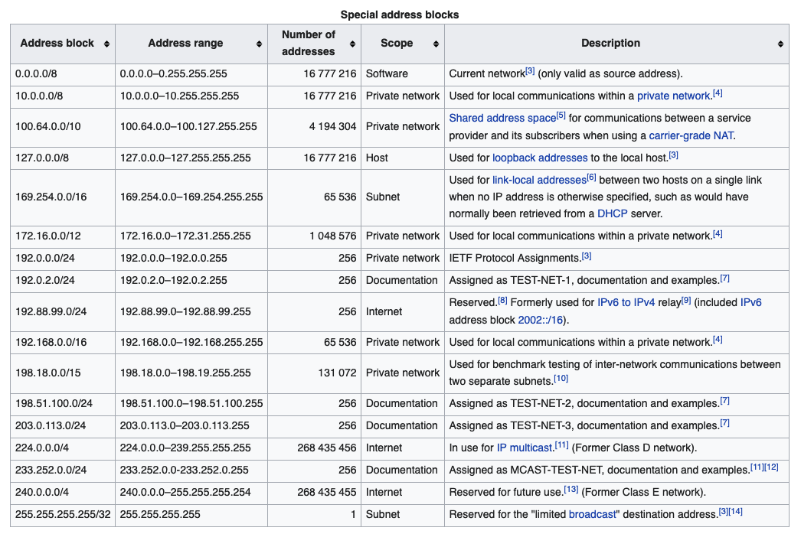

# NVS Aufgabenblock 6

Abgabe von David Pape, 01634454. Zeitaufwand: 4h.

## 24. Erklären Sie die Struktur einer IPv4 Adresse. Welche Adress-Klassen gibt es? Welche Bereiche sind für spezielle Zwecke reserviert?

Eine IPv4-Adresse besteht aus 4 bytes, gewöhnlich als punkt-seperierte Dezimalzahlen dargestellt wie:

* `192.168.8.1`
* `8.8.8.8`

Dabei sind wir natürlich auf $2^{32}$ (~4bn) Adressen eingeschränkt, und weil das zu Anfangszeiten des Internets eine unglaublich große Zahl war, haben einige Firmen wie HP und Apple großzügigerweise Millionen von Adressen zugeteilt bekommen. Heute reicht diese Zahl nicht mehr und daher gibt es [IPv6](ip6).

### Subnets

Zwecks Organisation hat man IP-Adressen in Subnets aufgeteilt, indem man den ersten Teil einer IP-Adresse als das Subnetz identifizierende Prefix interpretiert (**network portion**), und nur den letzten Teil als eigentliche Adresse des Rechners (**host portion**). Es gibt 3 Klasssen von Netzwerken:

1. **Class A**: Das erste Byte ist die network portion.
2. **Class B**: Die ersten zwei Bytes sind die network portion.
3. **Class C**: Die ersten drei Bytes sind die network portion.

Die **netmask** ist dabei die mittels logischem AND anzuwendende Bitmask, wenn man aus der ganzen IP nur die network portion will: für Class C z.B. `255.255.255.0`

\pagebreak

### Reserved addresses

## 25. Was versteht man unter „Classless Interdomain Routing (CIDR)"?

Es gab schlussendlich viel zu wenige (und viel zu riesige) Class A, und auch zu wenige Class C Netzwerke. Man hat mit CIDR dann auch "Zwischendinger" erlaubt, also $n$ Bits als network portion und nicht nur $n$ Bytes. Entsprechend gibt es netmasks der Form `255.255.255.252`; da das unwieldy ist erlaubt man auch `192.168.8.1/30`, wobei die `/30` dafür steht, dass die Netmask 30 leading `1`s hat.

## 26. Wie kann man den Verwalter einer IP-Adresse herausfinden?

Über die `whois`-Datenbanken der zuständigen Registrars, z.B. Denic für `.de`, oder bei Webseiten, die diese Information sammeln.

## 27. Beschreiben Sie, welche Schritte ein „Host" durchführen muss, um ausgehende IPv4 Pakete zu „routen"- wie wird die sog. „routing table" am Host abgearbeitet? Mit welchen OS-Programmen kann man die Routing-Tabellen ansehen/bearbeiten?

Man kann die routing table unter Linux mit `ip route show` einsehen (für IPv6 mit `ip -6 show`).

* First, the sender creates a packet with its IP as source, and the destination IP as destination
* The sender checks whether it's a local or remote destination 
  * (by checking the [subnet mask](ip4#Subnets): `( my_ip AND netmask ) = ( destination_IP AND netmask )`)
* If it's local find the destination's [MAC](MAC) address using [ARP](ARP)
* If it's remote, we'll look up our **routing table**
    * this is basically a list of known routes (an address with a netmask, and an associated address to go to)
    * we look for the "closest match" route that we can find:
      * first, check if we have a direct route
        * that means netmask is `/32`
      * then check if we have a route to the destination's subnet
        * meaning one for which `( route AND netmask ) = ( destination_IP AND netmask )` holds
      * Otherwise use the default route
        * the default route is not guaranteed to exist, so we may get `Destination unreachable` here
        * if it exists, it's typically going to point to the local gateway (i.e. router)
        * The router is also going to have a routing table and repeat this same process.
        * We're basically making it the problem of our router
        * Routers know a bit more about the network topology, and may in turn be able to make this the problem of some backbone which is going to know even more, and so on; until the packet finally reaches its destination.

## 28. Ein 3000 Byte (inkl. IP Header) großes IPv4 Datagramm muss über eine Netzwerk-Verbindung (Link) mit einer maximalen Fragmentgröße (MTU) von 1500 Bytes übertragen werden. Erläutern Sie die Unterschiede der IP Header der einzelnen Fragmente zum IP Header des originalen Datagramms.

Folgende Felder werden sich unterscheiden:

* Total Length
* Identification
* Flags: das erste Fragment bekommt 001, das letzte 000
* Fragment Offset: das erste Fragment bleibt 0, das letzte bekommt einen Wert um 1500
* Header Checksum

